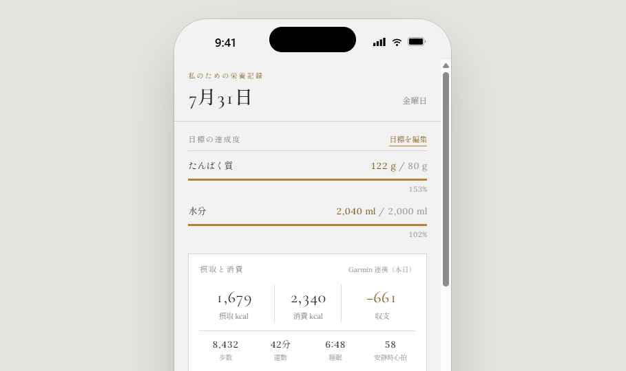
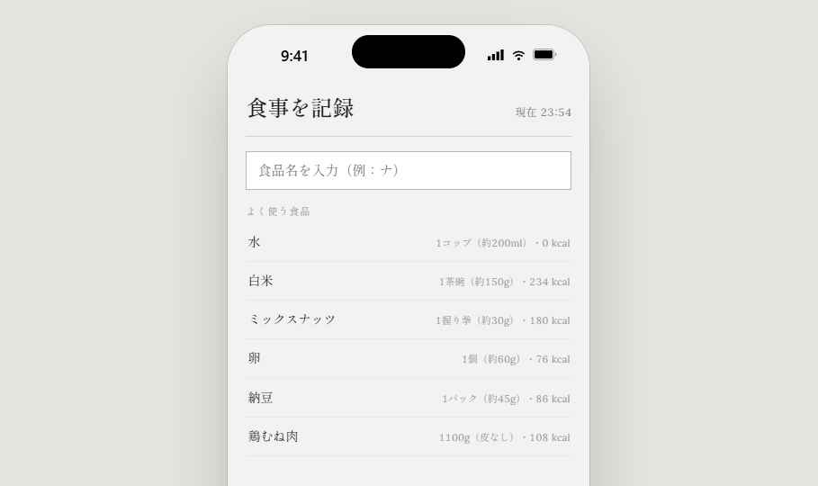
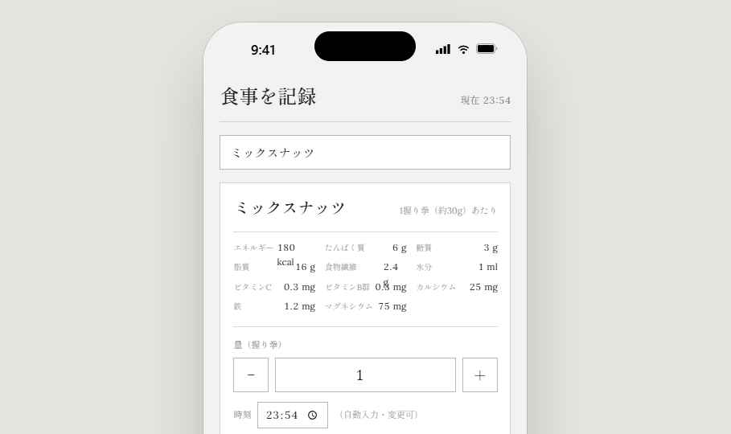
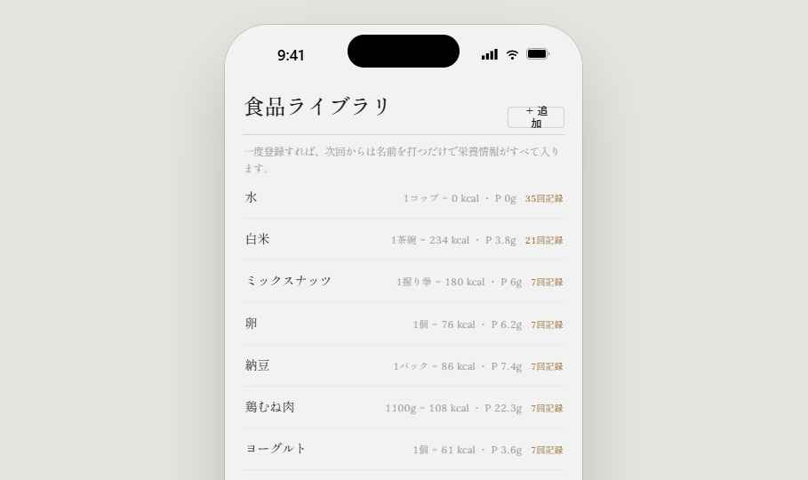
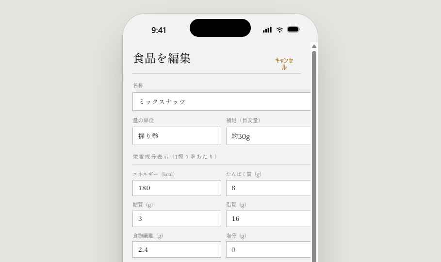
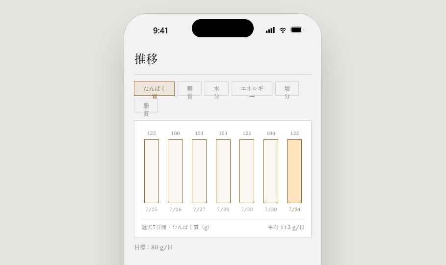
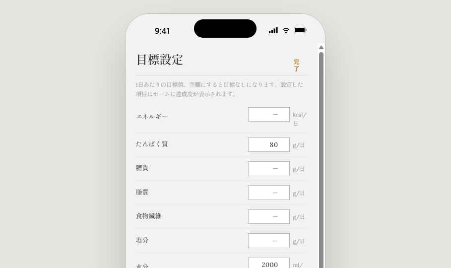
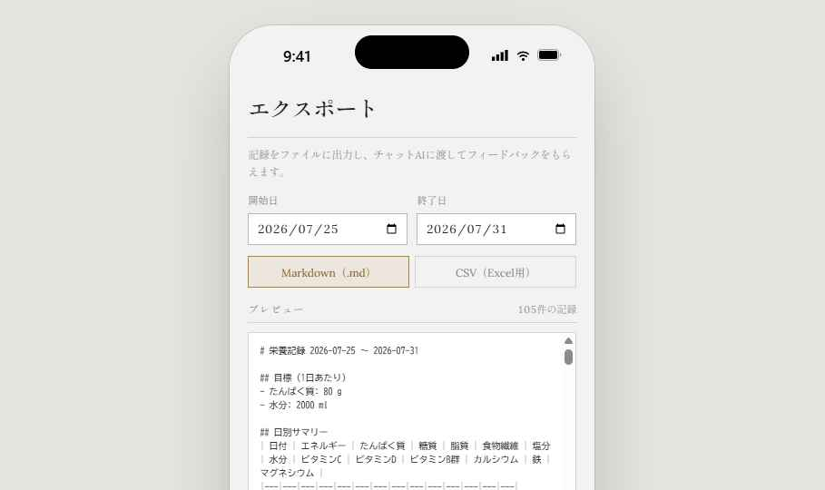

# 要件定義書・開発計画書 — 私のためだけの栄養管理アプリ

> 本書は Codex（AI コーディングエージェント）への実装指示書である。
> UI プロトタイプ（栄養記録.dc.html）が正であり、画面構成・文言・挙動はそれを再現すること。

---

## 0. 前提環境（固定条件）

| 項目 | 値 |
|---|---|
| 利用者 | 単一ユーザー（本人のみ）。アカウント機能・サーバー不要 |
| スマートフォン | Samsung Galaxy A53 5G（SC-53C, docomo）。Android 14 以降に更新済みであること（後述のヘルスコネクトが OS 組み込みになるため） |
| ウェアラブル | Garmin Venu 2 Plus |
| Garmin 公式アプリ | Garmin Connect（Venu 2 Plus とペアリング済み） |
| 開発形態 | Android ネイティブ単体アプリ。オフライン動作。データはすべて端末内 |

## 1. 目的

- 毎日ほぼ同じ食事をとるユーザーが、**最小の手数**で食事（たんぱく質・糖質・脂質・ビタミン・ミネラル・水分・塩分・添加物）を記録できる。
- 記録を重ねるほど入力が楽になる（食品ライブラリの学習的挙動）。
- Garmin Venu 2 Plus の活動データ（消費カロリー・歩数・運動・睡眠・心拍）と突き合わせ、摂取と消費の**相対評価**を可視化する。
- 任意期間の記録を **Markdown / CSV(Excel)** に出力し、チャット AI に渡してフィードバックを得る。

## 2. 技術スタック（指定）

| レイヤ | 技術 | 理由 |
|---|---|---|
| 言語 / UI | Kotlin + Jetpack Compose | ヘルスコネクト SDK が androidx ネイティブのため |
| DB | Room (SQLite) | ローカル完結・型安全 |
| Garmin 連携 | **androidx.health.connect:connect-client**（ヘルスコネクト） | §7 参照。Garmin と直接通信しない |
| 非同期 | Kotlin Coroutines + Flow | 標準 |
| ファイル出力 | Storage Access Framework（CreateDocument）＋共有 Intent | md / csv を保存・共有 |
| 最低 SDK | minSdk 28 / targetSdk 最新。ヘルスコネクト機能は Android 14+ で有効化 | A53 は Android 14 に更新可 |

アーキテクチャ: 単一モジュール MVVM（ViewModel + Repository + Room DAO + HealthConnectManager）。過剰な分割はしない。

## 3. データモデル

### 3.1 Food（食品ライブラリ）
```
id: Long (PK)
name: String            // 例「ミックスナッツ」
unit: String            // 独自単位。例「握り拳」「杯」「個」「100g」
unitNote: String?       // 目安量。例「約30g」
lastAmount: Double      // 前回記録した量（次回のデフォルト値）
additives: List<String> // 添加物名リスト（JSON カラム）
per*: Double            // 1単位あたりの栄養（下記13項目、全て NOT NULL default 0）
```

栄養13項目（キー / 表示名 / 単位）:
kcal エネルギー kcal ／ protein たんぱく質 g ／ sugar 糖質 g ／ fat 脂質 g ／ fiber 食物繊維 g ／ salt 塩分 g ／ water 水分 ml ／ vitC ビタミンC mg ／ vitD ビタミンD µg ／ vitB ビタミンB群 mg ／ ca カルシウム mg ／ fe 鉄 mg ／ mg マグネシウム mg

### 3.2 Entry（食事記録）
```
id: Long (PK)
foodId: Long (FK → Food)
amount: Double          // 単位数（0.5 刻み入力可）
timestamp: Instant      // 記録時刻。デフォルトは現在時刻（自動入力）、変更可
```
栄養値は保存しない（Food.per × amount で都度計算）。Food 編集時は過去記録にも新しい値が反映される仕様でよい（本人用のため）。

### 3.3 Goal（目標）
```
nutrientKey: String (PK)  // 上記13項目のキー
target: Double            // 1日あたり目標。行が無ければ目標なし
```
初期値: protein=80(g), water=2000(ml)。

### 3.4 DailyActivity（Garmin 由来・キャッシュ）
```
date: LocalDate (PK)
totalCaloriesKcal, activeCaloriesKcal: Double?
steps: Long?
exerciseMinutes: Int?
sleepMinutes: Int?
restingHr: Int?
syncedAt: Instant
```
ヘルスコネクトから日次集計して保存（§7.4）。

### 3.5 時間帯の導出（保存しない）
hour < 5 深夜 / <10 朝 / <15 昼 / <18 間食 / <23 夜 / それ以外 深夜。

## 4. 画面仕様（5タブ + 1画面）

**UI モック画像**（プロトタイプのスクリーンショット。実装はこれを忠実に再現すること。画像は `ui/` に同梱。周囲の iPhone 風フレームはプロトタイプ表示用であり、実装対象はフレーム内部の画面のみ）

| ホーム | 記録（検索） | 記録（食品確定） | 食品ライブラリ |
|---|---|---|---|
|  |  |  |  |

| 食品編集 | 推移 | 目標設定 | 出力 |
|---|---|---|---|
|  |  |  |  |

下部タブ: ホーム / 記録 / 食品 / 推移 / 出力。目標設定はホームの「目標を編集」から遷移。

### 4.1 ホーム
- 日付ヘッダー（M月D日・曜日）。
- **目標の達成度**: Goal がある項目ごとに「現在値 / 目標値」＋細いプログレスバー＋達成率%。
- **摂取と消費**（Garmin カード）: 摂取kcal（本日 Entry 合計）／消費kcal（DailyActivity.totalCalories）／収支（摂取−消費、符号付き）。下段に 歩数・運動分・睡眠時間・安静時心拍。最終同期時刻と手動同期ボタンを併記。
- **今日の栄養素**: 13項目の当日合計一覧。目標がある項目は達成率%を添える。
- **今日摂取した添加物**: 「添加物名 ×回数」のチップ列。なしなら「なし」。
- **本日の記録**: 時刻・時間帯タグ・食品名・量・kcal のタイムライン。スワイプまたは×で削除。

### 4.2 記録（最重要・入力の容易化）
1. 検索欄に1文字入れるたび、`name LIKE '%q%'` で部分一致候補を**使用回数の多い順**に最大6件表示。空欄時は「よく使う食品」上位6件。
2. 候補タップで **量以外の全項目が即座に確定**（食品カード表示: 名称・1単位あたり栄養・添加物タグ）。
3. 量: ステッパー（±0.5）＋数値直接入力。**デフォルトは lastAmount（前回と同じ量）**。
4. 時刻: 現在時刻を自動セット（変更可）。
5. プレビュー行「この量で：xxx kcal・たんぱく質 xg・糖質 xg・水分 xml」。
6. 保存 → Entry 追加、Food.lastAmount 更新、トースト表示、入力リセット。
7. 完全一致する食品が無い検索語の場合「「◯◯」を新しい食品として登録」ボタン → 食品タブの新規フォームへ名称プリセットで遷移。**登録した瞬間から次回は候補に出る**（2回目以降はナッツと同じ扱い）。

### 4.3 食品ライブラリ
- 一覧（使用回数順）: 名称／1単位=kcal・P／記録回数。タップで編集。
- フォーム: 名称・量の単位・補足（目安量）・栄養成分表示13項目（数値、未入力=0）・添加物（「、」区切りテキスト）。保存／削除（削除時は関連 Entry も削除、確認ダイアログあり）。
- 初期シード: プロトタイプと同じ10食品（ミックスナッツ、水、白米、卵、納豆、鶏むね肉、プロテイン、ヨーグルト、サラダチキン、バナナ）を初回起動時に投入。

### 4.4 推移
- 栄養素セレクタ（たんぱく質/糖質/水分/エネルギー/塩分/脂質）。
- 過去7日（設定で14日）の日別合計バーチャート。当日を強調。下部に期間・平均/日。目標があれば目標値を注記（余裕があれば水平線）。
- 追加: 摂取kcal と消費kcal の7日比較（DailyActivity があれば）。

### 4.5 目標設定
- 13項目それぞれに数値入力（単位/日 表示）。空欄で目標なし。即時保存。

### 4.6 出力（エクスポート）
- 期間: 開始日・終了日（DatePicker、デフォルト直近7日）。
- 形式: Markdown(.md) / CSV(.csv, UTF-8 **BOM付き**でExcel文字化け回避)。
- プレビュー＋件数表示。「ファイル保存」（SAF）と「共有」（ACTION_SEND、チャットAIアプリへ直接渡す）と「全文コピー」。
- **Markdown 構成**（チャットAIが解析しやすい形）:
  1. `# 栄養記録 {from} 〜 {to}`
  2. `## 目標（1日あたり）` 箇条書き
  3. `## 日別サマリー` 13項目のテーブル
  4. `## Garmin 活動データ` 日付・消費kcal・歩数・運動分・睡眠・安静時心拍のテーブル（データ無い日は —）
  5. `## 食事ログ` 日付ごとに `- HH:MM 時間帯：名称 ×量単位（kcal / P g）`
  6. `## 添加物の摂取回数` 箇条書き
- **CSV 構成**: 1行=1記録。列: 日付,時刻,時間帯,名称,量,単位,栄養13項目(量換算済),添加物。末尾に日別サマリー行を含めない（別シート相当が必要なら `日別サマリー.csv` を別出力）。

## 5. UI デザイン
プロトタイプ（Classical デザインシステム）を踏襲: 明るい紙色の地(#f3f2f2系)、見出しセリフ体（Cormorant Garamond 相当＋日本語明朝: Noto Serif JP）、罫線（ヘアライン）中心・塗りを避ける、アクセント #b68235 は線と小さなマークに限定、ボタンは枠線のみ。数字は tabular figures。トーンは淡々とした記録調（絵文字・励まし文言なし）。

## 6. 非機能要件
- 完全オフライン動作（ヘルスコネクト読み取りもローカル IPC であり通信不要）。
- 起動→記録完了まで、既存食品なら **3タップ以内**（タブ→候補→保存。量が前回と同じ場合）。
- データは端末内のみ。バックアップ用に「全データを JSON でエクスポート／インポート」をおまけ機能として出力画面に置く。
- 単体テスト: 栄養合計計算・エクスポート文字列生成・ヘルスコネクト集計のマッピングに対して必須。

## 7. Garmin 連携仕様（最重要・実装者向け解説）

### 7.1 方式の結論
**アプリは Garmin と直接通信しない。** データの流れ:

```
Venu 2 Plus --(BLE, 自動)--> Garmin Connect アプリ
Garmin Connect --(2025年6月〜対応)--> Android ヘルスコネクト (Health Connect)
本アプリ --(androidx.health.connect ClientAPI, 読み取りのみ)--> ヘルスコネクト
```

- Garmin → ヘルスコネクトは一方通行の同期。本アプリは読み取り専用でよい（書き込み権限を要求しない）。
- 同期されるのは歩数・カロリー・心拍・睡眠などのウェルネス/活動データ。ワークアウトの詳細（GPS軌跡等）は対象外だが本アプリには不要。
- 代替案とその不採用理由:
  - **Garmin Health API（公式 REST/Webhook）**: 法人・審査制の開発者プログラムでサーバー必須。個人ローカルアプリに不適。
  - **非公式 Garmin Connect API ラッパー**: 認証仕様変更で壊れやすい。不採用。
  - **FIT/CSV 手動エクスポート**: §7.6 のフォールバックとしてのみ実装。

### 7.2 ユーザー側の事前設定（アプリ内にセットアップガイド画面として表示すること）
1. Android 14+ の設定 → セキュリティとプライバシー → プライバシー → ヘルスコネクト を有効化。
2. Garmin Connect アプリ → 設定 → 接続済みアプリ → Health Connect → 同期を有効化し、歩数・カロリー・心拍・睡眠 の共有を許可。
3. 本アプリ初回起動時にヘルスコネクトの読み取り権限ダイアログを許可。

### 7.3 実装: 依存とパーミッション
```kotlin
implementation("androidx.health.connect:connect-client:<latest>")
```
AndroidManifest に読み取り権限（読むデータ型ぶん）:
```
android.permission.health.READ_STEPS
android.permission.health.READ_TOTAL_CALORIES_BURNED
android.permission.health.READ_ACTIVE_CALORIES_BURNED
android.permission.health.READ_SLEEP
android.permission.health.READ_HEART_RATE
android.permission.health.READ_RESTING_HEART_RATE
android.permission.health.READ_EXERCISE
```
＋ ヘルスコネクトのプライバシーポリシー表示用 Activity intent-filter（`androidx.health.ACTION_SHOW_PERMISSIONS_RATIONALE`）。
起動時に `HealthConnectClient.getSdkStatus()` で利用可否を判定し、未対応/未インストール時は §7.6 フォールバック UI を出す。

### 7.4 実装: 日次集計（HealthConnectManager）
`aggregate` / `aggregateGroupByPeriod` を用い、日付境界はローカルタイムゾーン:
| DailyActivity 列 | ヘルスコネクトのメトリクス |
|---|---|
| steps | `StepsRecord.COUNT_TOTAL` |
| totalCaloriesKcal | `TotalCaloriesBurnedRecord.ENERGY_TOTAL` |
| activeCaloriesKcal | `ActiveCaloriesBurnedRecord.ACTIVE_CALORIES_TOTAL` |
| exerciseMinutes | `ExerciseSessionRecord.EXERCISE_DURATION_TOTAL` |
| sleepMinutes | `SleepSessionRecord.SLEEP_DURATION_TOTAL`（前日20:00〜当日12:00 の窓で当日分とみなす） |
| restingHr | `RestingHeartRateRecord` 当日最新値（無ければ `HeartRateRecord.BPM_MIN` で代替） |

- 収支 = 摂取kcal − totalCaloriesKcal（total には基礎代謝が含まれる。activeCalories は参考表示）。
- 複数アプリが同種データを書いている場合に備え、可能なら dataOrigin を Garmin Connect のパッケージ（`com.garmin.android.apps.connectmobile`）でフィルタする。フィルタ不可の集計はそのまま使用し、設定画面に注記。

### 7.5 同期タイミング
- ホーム表示時（onResume）に当日+過去7日を再集計（デバウンス: 前回同期から5分以内はスキップ）。
- 手動同期ボタン。
- WorkManager で1日1回（夜間）過去7日をバックフィル。

### 7.6 フォールバック（ヘルスコネクト不可時）
- 消費カロリー等の手動入力欄（ホームのカードから編集）。
- Garmin Connect の Web (connect.garmin.com) からエクスポートした CSV を取り込むインポータ（列マッピングは実装時に実ファイルで確認）。

## 8. マイルストーン（Codex への実装順序）

1. **M1 コア記録**: Room スキーマ＋シード、記録タブ（検索→1タップ→量→保存）、ホームの栄養合計・タイムライン。→ この時点で日常利用開始可能
2. **M2 ライブラリ/目標/推移**: 食品CRUD、新規食品フロー、目標設定、達成度バー、バーチャート
3. **M3 エクスポート**: md/csv 生成、SAF保存、共有Intent、コピー
4. **M4 Garmin**: ヘルスコネクト権限フロー、日次集計、ホームのカード、WorkManager、セットアップガイド画面
5. **M5 仕上げ**: フォールバック手動入力/CSVインポート、JSONバックアップ、テスト、アイコン

## 9. 受け入れ基準（抜粋）
- 「ナ」と入力→「ミックスナッツ」タップ→保存 の3操作で、前回と同じ量の記録が1件増える。
- 新規食品を一度登録すると、直後の検索で候補に出て量以外が自動で埋まる。
- 目標 protein=80g のとき、当日合計 62g ならホームに「62 / 80 g・78%」とバーが表示される。
- Garmin Connect がヘルスコネクトに同期済みの端末で、ホームの消費kcal・歩数が Garmin Connect アプリの当日値と一致（±集計境界誤差）する。
- 任意の7日間を Markdown 出力し、そのままチャットAIに貼れる（テーブルが崩れない）。CSV は Excel でダブルクリックして文字化けしない。
- 機内モードでも記録・閲覧・出力が全機能動作する。

## 10. リスクと備考
- ヘルスコネクトの Garmin 対応は 2025年6月開始の比較的新しい経路。Garmin Connect アプリのバージョンを最新に保つこと。同期しない場合はまず Garmin Connect 側の Health Connect 設定を確認。
- 睡眠の日付帰属（跨ぎ）は §7.4 の窓ルールで固定し、テストで担保。
- ビタミンB群は簡略化のため合算1値とする（将来 B1/B2/... に分割する場合は Food テーブルに列追加のマイグレーション）。
- 食品の栄養値はユーザーがパッケージの栄養成分表示から転記する前提。データベース連携（食品成分表）はスコープ外。
